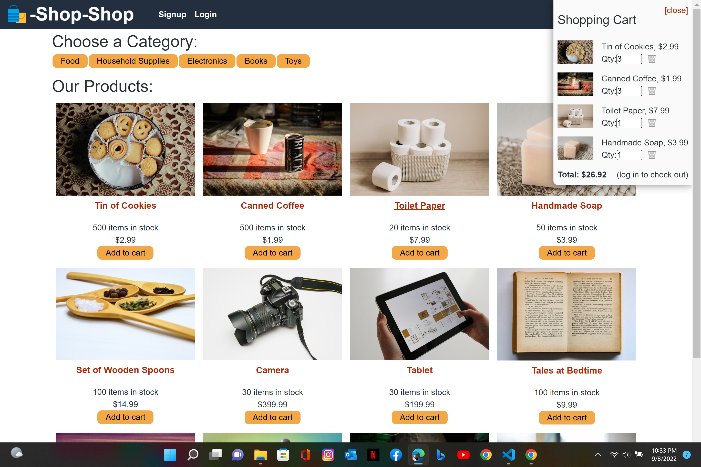

  # Shop-Shopp

  * 
  
  ## License 

   * Licensed by [ISC License](https://choosealicense.com/licenses/isc/)

  ## Link to app

  -[Vist Application](https://shop-shopp-redux.herokuapp.com/) 

  ## Link to repo

  -[Visit Rository](https://github.com/Codechef27/shop-shopp)

  ## Table of Contents

  - [Description](#description)
  - [Installation](#install-instructions)
  - [Languages](#languages-used)
  - [Usage](#usage)
  - [Contribution](#contributing)
  - [Test](#test)
  - [Questions](#questions)

  ## Description

  A ecommerce application. Allows users to browse to create an account, login, browse items and add items to the cart. 

  ## Languages Used

  HTML, CSS, Javascript, React, redux, graphql, apollo

  ## Install Instructions

  Clone the repository, install the packages in client, server and main directories. 

  ## Tests

  test were performed in the react testing suit. Tests were performed on state management. 

  ## Contributing

  Bradley j Kennett

  ## Questions

  Contact Me!

  * Github Account:  [Codechef27](https://github.com/Codechef27)
  * Email Me:  bradleyjkennett@gmail.com

  ## Scrennshot

  
